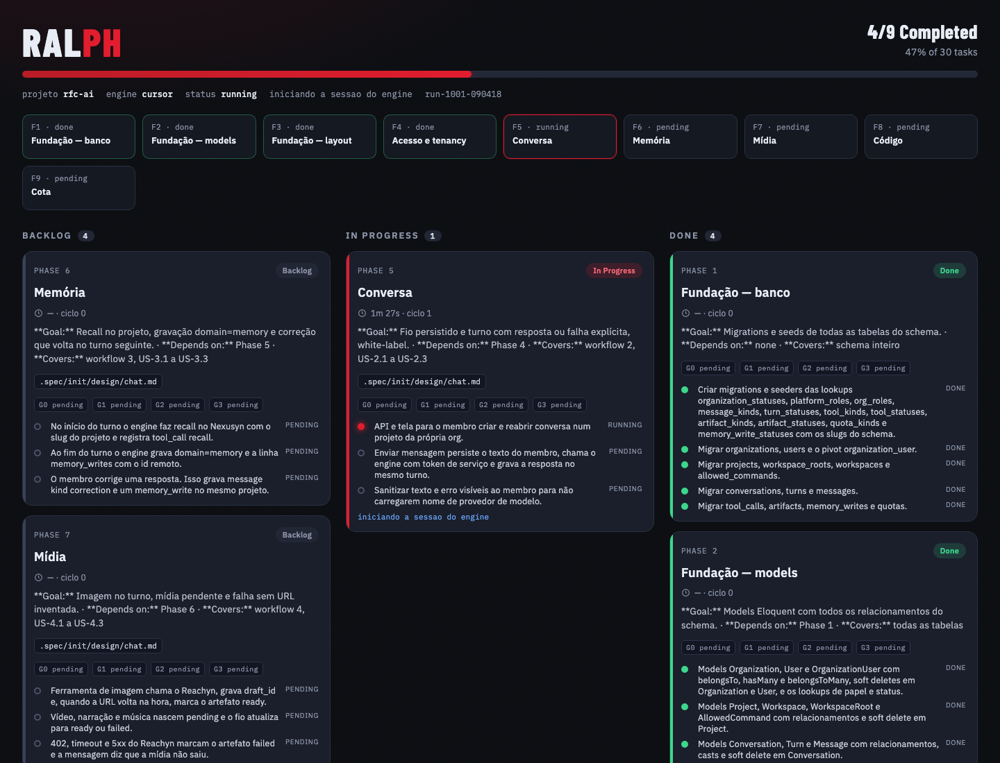

# rfc-harness 2.0.0 (`rfc-harness`)

Canonical path: `/Volumes/M5SSD/Projetos/rfc-harness-v1`. Fork of Beer and Code `bc-harness` 0.2.0.

```
ralph cursor | ralph claude | ralph minimax | ralph codex | ralph board
```

## Kanban board

The run visualization is the web board. `ralph` opens `http://127.0.0.1:3847` on this machine only (override the port with `RALPH_BOARD_PORT`). `ralph board` reopens the board for a run already on disk.



The header shows the mark, how many phases are done, and the run bar. The line under it names the project, engine, status, and run id. Each phase is a chip; the one in execution has a red border.

The three columns are **Backlog**, **In Progress**, and **Done**. A phase card shows duration, cycle, a slice of the phase text, cited files, the four gates (G0–G3), and the tasks. A failed phase stays in In Progress. The page reads `/state.json` every second: `run.tsv` is the orchestrator state and `live.tsv` is the task the session is on right now.

The terminal panel (`ralph-watch.sh`, `--dashboard`) is the same state drawn in the shell. The board is the interface for watching the run.

> 🇧🇷 [Documentação em português](README.pt-BR.md)

A [Claude Code](https://claude.com/claude-code) plugin with commands, agents, and scripts that take a project from idea to implementation in a structured way: formal specification, phased planning, and autonomous execution with mechanical validation — while keeping a human in control at every decision point.

The harness is **stack-agnostic**: language, framework, commands, and conventions are defined by the project's own documents (`AGENTS.md`, `CLAUDE.md`, the `.spec/` chain), never by the harness.

## Workflow overview

```
 IDEA                                              CODE
   │                                                 ▲
   ▼                                                 │
 /init:project-description  ──┐                      │
 /init:user-stories           │  init chain          │
 /init:database-schema        │  (.spec/init/)       │
 /init:project-phases       ──┘                      │
   │                                                 │
   │            /plan "<feature description>"        │
   │            (.spec/features/<slug>/)             │
   ▼                                                 │
 project-phases.md  or  PHASES.md ────────► scripts/ralph.sh
                                            (autonomous execution
                                             with 4 gates)

 /ai-context ─► AGENTS.md + docs/agents/*  (documents the ALREADY implemented
                                            code; feeds /plan and ralph)
```

Three independent pipelines that fit together:

1. **`/init`** — from zero to a project build plan (description → user stories → schema → phases).
2. **`/plan`** — from a feature description to a formal SPEC + phased plan, ready for execution.
3. **`ralph.sh`** — executes any phase document autonomously, one fresh agent session per phase, with mechanical gates and one commit per completed phase.

Cross-cutting: **`/ai-context`** keeps the context tree (`AGENTS.md`, `CLAUDE.md`, `docs/agents/*.md`) in sync with the real code.

## Installation

This repository is a Claude Code plugin (`.claude-plugin/plugin.json`). Install it via marketplace/local path according to your plugin setup:

```
/plugin marketplace add /Volumes/M5SSD/Projetos/rfc-harness-v1
/plugin install rfc-harness
```

Commands are namespaced: `/rfc-harness:init`, `/rfc-harness:plan`, `/rfc-harness:ai-context` (abbreviated without the namespace throughout this document).

To refresh Cursor / OpenCode / Codex / SGM copies:

```
./scripts/sync-hosts.sh
```

`ralph.sh` is a standalone bash script — copy or reference `scripts/ralph.sh` and run it directly in the target project's repository.

**ralph.sh prerequisites:**

- Codex engine: `npm install -g @openai/codex` + `OPENAI_API_KEY`
- Claude engine: `npm install -g @anthropic-ai/claude-code` + `ANTHROPIC_API_KEY`
- Cursor engine: Cursor Agent CLI (`agent` or `cursor-agent`) + `agent login`
- Bash 4+ (macOS `/bin/bash` is 3.2 — `brew install bash`; ralph re-execs it automatically)
- Root of a git repository with a **clean** working tree

## Commands

### `/init` — init chain router

Shows the state of the `.spec/init/` artifacts (present / absent / stale), the **OBSERVED** stack (manifests only — `.env` is never read), and **invokes the next command in the chain** (one hop per run — re-run `/init` to advance). Writes nothing itself; all authoring lives in the invoked `init:*` command.

The same snapshot is available from another terminal without starting `/init`:

```bash
./scripts/init-status.sh              # colored panel
./scripts/init-status.sh --plain      # markdown (what /init consumes)
```

The chain, in order:

| # | Artifact | Command | Inputs |
|---|---|---|---|
| 1 | `.spec/init/project-description.md` | `/init:project-description` | — (head of chain) |
| 2 | `.spec/init/user-stories.md` | `/init:user-stories` | project-description |
| 3 | `.spec/init/database-schema.md` | `/init:database-schema` | description + stories |
| 4 | `.spec/init/project-phases.md` | `/init:project-phases` | description + stories + schema |
| — | `.spec/init/design/` | manual (optional) | — |

Every generated artifact carries a **stamp** of its inputs on line 3 (`file@sha256:<12 chars>`). If an input changes later, `/init` detects it and reports the downstream artifact as *stale* — re-running the corresponding command is upsert-safe: it interviews only about the deltas and refreshes the stamp.

- **`/init:project-description`** — interviews the developer, discovers the stack (OBSERVED / INFERRED / UNKNOWN), and produces a structured project description.
- **`/init:user-stories`** — derives structured, testable user stories from the description.
- **`/init:database-schema`** — derives a suggested database schema in DBML.
- **`/init:project-phases`** — plans the build into numbered, agent-ready phases with tasks, acceptance criteria, and feature tests. **This is `ralph.sh`'s default input.** Reads `.spec/init/design/` when present (screen/component refs).

### `/plan` — feature planning pipeline

```
/plan "<feature description or path to a description file>"
```

Produces, under `.spec/features/<slug>/`:

| Artifact | Content |
|---|---|
| `SPEC.md` | Formal specification in GEARS syntax, with RIGID/FLEXIBLE sections, AS IS / TO BE diagrams, and binary acceptance criteria |
| `PLAN.md` | Architecture-aware task decomposition with dependency phases, risks, and validation criteria |
| `PHASES.md` | The PLAN rendered in the format executable by `ralph.sh` |
| `openapi.yaml` / `service.proto` / `asyncapi.yaml` | Formal contracts, when the SPEC declares an API surface (conditional) |

Key characteristics:

- **No issue tracker** — the confirmed description + ACs are the source of truth. No Jira.
- **Complexity tier** (`light` / `standard` / `complete`) classified from objective signals (requirement count, multi-repo, contracts, messaging); adjusts SPEC depth, whether the clarifier is mandatory, and contract emission.
- **Human checkpoints** at every step: confirmation of the normalized input, SPEC approval, ambiguity resolution, decomposition sign-off.
- **Two-phase clarifier** — the agent analyzes the SPEC and returns prioritized questions; the router presents them to the developer and re-invokes the agent with the answers, which updates the SPEC in-place.
- **Architecture gate** — requires `AGENTS.md` / `docs/agents/` (or warns and flags `architecture_reference_status: missing`). The pipeline never plans silently without architecture context.
- **Never writes application code.** The close-out points at the execution handoff:

```bash
./ralph.sh .spec/features/<slug>/PHASES.md
```

### `/ai-context` — canonical context tree

```
/ai-context [path] [+id] [-id] [--adopt]
```

Generates or refreshes 10 artifacts from the **implemented code** (never reads `.spec/`):

| Artifact | Content |
|---|---|
| `AGENTS.md` | 6 sections: commands, conventions, behavioral rules, setup, references, docs index |
| `CLAUDE.md` | ≤ 400-byte redirect to AGENTS.md |
| `docs/agents/project_overview.md` | Purpose, consumers, macro flow |
| `docs/agents/architecture.md` | Style, layout, layer responsibilities |
| `docs/agents/tech_stack.md` | Language, framework, runtime, test tooling |
| `docs/agents/coding_guidelines.md` | ≥ 3 observed patterns + enforcement |
| `docs/agents/domain_rules.md` | Business rules as implemented |
| `docs/agents/api_contracts.md` | Endpoints, payloads, message formats |
| `docs/agents/data_model.md` | Entities, storage, migrations |
| `docs/agents/dependencies.md` | External services, internal libs, shared infra |

Core rules:

- **Idempotent** — safe upsert; re-running updates only what drifted.
- **Documents reality (AS IS)** — code, manifests, CI, and configs are the only sources; never invents, never prescribes.
- **Ownership contract** — every generated file carries a banner on line 3. A file without the banner (hand-written) is never clobbered; `--adopt` folds its concrete rules into the generated tree and takes ownership.
- **Preserves third-party blocks** — `<tag>...</tag>` regions (e.g. Laravel Boost) are re-appended verbatim on regeneration.
- `+id` / `-id` filters generate only a subset (e.g. `/ai-context +AGENTS +architecture`).

## `scripts/ralph.sh` — execution orchestrator

Reads a phase document, splits it on the `## Phase N: <title>` heading, and feeds each phase to a **fresh** Codex CLI, Claude Code, or Cursor Agent session, with no human interaction from start to finish.

```bash
./scripts/ralph.sh [options] [path-to-file]
```

With no argument, the input resolves in this order: `.spec/init/project-phases.md` → `.spec/project-phases.md` (pre-init layout, with a warning). A feature `PHASES.md` is also valid input.

> **Autonomy and permissions note**: ralph is an unattended orchestrator by design. Implementation sessions skip permission prompts — Claude with `--dangerously-skip-permissions`, Cursor with `--force` (`--yolo`) and sandbox disabled. The agent can edit files and run commands in the repository without prompting. Run it only in repositories you trust, ideally in a disposable branch or isolated environment (container/VM). Every phase lands as a separate commit, so `git revert`/`git reset` always gets you back. The verification session (gate 3) is read-only: Claude is restricted to `Read,Glob,Grep`; Cursor runs with `--mode ask` and sandbox enabled (no `--force`).

### Invariants

1. Every phase **and** every fix cycle runs in a fresh session with a self-contained prompt. Sessions are never reused.
2. Zero questions — fully autonomous execution.
3. A phase is only "complete" when it passes the **4 mechanical gates**, never by the engine's exit code.
4. API usage limit → waits for the reset and re-runs the **same** phase, without consuming a fix cycle.
5. **One commit per completed phase** (`feat(phase-N): <title>`).

### The 4 gates

| Gate | Question | How it decides |
|---|---|---|
| 0 | Did the engine actually finish? | claude: `is_error` in the result JSON; cursor: `is_error` when the stream emits `type:result`, otherwise exit code; codex: exit code |
| 1 | Did the session write code? | Tree signature before/after. **A signal, not a verdict** — an already-implemented phase makes the engine (correctly) write nothing; the signal feeds the fix-cycle cause |
| 2 | Does the test suite pass? | Run **by ralph itself**, outside the agent session — the agent cannot "fake green" |
| 3 | Is each task actually in the code? | Independent read-only verifier session that emits `TASK <n>: DONE/INCOMPLETE` per task. Runs on every phase by default (`RALPH_VERIFY=always`); on the claude engine it uses a cheap model (`sonnet`) |

Any red gate → **fix cycle**: a fresh session receives the full phase + the real failure cause (never a generic "tests failed"). Default: 3 cycles per phase.

Green gates with a clean tree → the phase was already implemented at HEAD: marked done, no commit.

### Test command detection (gate 2)

First rule that resolves wins: `--test-cmd` → `RALPH_TEST_CMD` → manifest detection (Laravel Sail → `composer test` → `php artisan test` → `npm test` → `pytest` → `go test ./...` → `cargo test`) → nothing resolved = gate 2 skipped with a loud warning (gate 3 holds the line alone).

Laravel Sail projects: the suite runs **inside the container** (`vendor/bin/sail test`); stopped containers abort at preflight — every gate 2 would fail and burn fix cycles for nothing.

### Options and variables

| Option | Effect |
|---|---|
| `--engine codex\|claude\|cursor` | Implementation engine (default: `codex`) |
| `--from N` | Starts at phase N (clears progress for phases ≥ N) |
| `--keep-going` | Continues after a phase fails (creates a `wip(phase-N)` commit; default: stop) |
| `--max-cycles N` | Fix cycles per phase (default: 3) |
| `--test-cmd "<cmd>"` | Project test command (gate 2) |
| `--no-verify` | Disables gate 3 |
| `--dashboard` | Live panel in the terminal (see below) |
| `--board` | Opens the Kanban board at `http://127.0.0.1:3847` |

| Variable | Effect |
|---|---|
| `RALPH_TEST_CMD` | Test command (gate 2) |
| `RALPH_VERIFY` | Gate 3: `always` (default) \| `auto` (saves tokens: only when gate 2's verdict isn't enough) \| `off` |
| `RALPH_VERIFY_MODEL` | Verifier model (claude default: `sonnet`) |
| `RALPH_MAX_CYCLES` | Fix cycles per phase (default: 3) |
| `RALPH_MAX_LIMIT_WAITS` | Consecutive usage-limit waits, per phase (default: 20) |
| `RALPH_LIMIT_WAIT_DEFAULT` | Fallback wait in seconds (default: 1800) |
| `RALPH_LIMIT_BUFFER` | Extra seconds after the reset (default: 60) |
| `RALPH_BASH` | Bash 4+ interpreter (macOS: ralph re-execs Homebrew bash when `/bin/bash` is 3.2) |

During each session, ralph exports `RALPH_ENGINE`, `RALPH_PHASE_TITLE`, `RALPH_PHASE_NUM`, `RALPH_PHASE_TOTAL`, `RALPH_PHASE_ATTEMPT`, and `RALPH_PHASE_MAX_ATTEMPTS` — useful for notification hooks (e.g. n8n).

### State and progress

Internal work lives in `.phases/` (registered in `.git/info/exclude`, without touching the project's `.gitignore`): split phases, prompts, logs, manifest, and `.progress`. Progress survives across runs, but only for the **same input** (sha256 stamp) — a changed phase document resets progress.

When `detect-project.sh` sits next to `ralph.sh`, preflight publishes the OBSERVED stack, env, and branch into `.phases/state/run.tsv` (the live panel shows them). Each cycle also writes a mechanical evidence contract at `.phases/logs/phase-NN.cycle-K.evidence.md` (`RESULT`, `GATES`, `TESTS` with COMMAND / EXIT / STATUS). That file is the truth source for the run — the agent is also asked to write a sibling `.agent-evidence.md`, but the orchestrator never trusts it over the gates.

Exit code: `0` = all phases green; `1` = some phase failed or aborted.

## `scripts/ralph-watch.sh` — terminal panel

The Kanban board is the run visualization. This script is the same reading, drawn in the terminal. ralph publishes run state to `.phases/state/` **always**, with or without `--dashboard`. `ralph-watch.sh` reads that state and draws the panel:

```bash
./scripts/ralph.sh --engine claude --dashboard   # panel in the same terminal
./scripts/ralph.sh --engine cursor --dashboard   # same panel, Cursor Agent CLI
./scripts/ralph-watch.sh /path/to/repo           # panel from another terminal
```

```
┌─────────────────── PROGRESSO ───────────────────┐ ┌──────────────── TRABALHO ATUAL ─────────────────┐
│ Fases  1/2      [███████████░░░░░░░░░░░░]  50%  │ │ Fase:      2 · Interface observável             │
│ Tasks  1/2      [███████████░░░░░░░░░░░░]  50%  │ │ Ciclo:     1/3    Gate: G2                      │
└─────────────────────────────────────────────────┘ └─────────────────────────────────────────────────┘
┌──────┬────────────────────────────────────────────┬────────────────┬───────────┬─────────────────────┐
│ F2   │ Interface observável                       │ ▶ Em execução  │ 1         │ G0 ✓ G1 ✓ G2 ⋯ G3 · │
│ T1   │   ↳ renderizar títulos longos              │ ✓ Concluída    │ –         │ –                   │
│ T2   │   ↳ cobrir falhas de rede com retry        │ ▶ Em execução  │ –         │ –                   │
└──────┴────────────────────────────────────────────┴────────────────┴───────────┴─────────────────────┘
```

### Where per-task progress comes from

A phase is **one** agent session, so ralph could not know where the session is — unless the session says so. On the **claude** and **cursor** engines it does:

The session runs with `--output-format stream-json`, which emits events line by line **while** it works. ralph reads that stream and rewrites progress into `.phases/state/live.tsv`, from four sources, in this order of precedence:

1. **Text markers** (primary source). The prompt tells the agent to write, as a standalone line, `RALPH-TASK <n> START` before starting item *n* and `RALPH-TASK <n> DONE` once it is ready. It is plain text: it **depends on no tool at all** — which is what matters, because in a headless session (`claude -p`) task-list tools simply do not exist, even when the agent tries to load them via `ToolSearch`.
2. **The agent's task list**, when the session has one (`TaskCreate`/`TaskUpdate` or `TodoWrite`): its `in_progress`/`completed` transitions become progress.
3. **Observational fallback** — with no marker and no list, ralph infers from what the agent edits. A `/plan` plan declares `Arquivos:` on every item, and it is that match (edited path ↔ file declared by the task) that provides the granularity; without the declaration it falls back to the task's own text. On entering a task the earlier ones count as done — the agent works in order, and not every task has a file of its own.
4. **Sign of life**: as soon as the session opens, task 1 shows as running — never a whole phase frozen at "Pendente".

At the end of the phase, **gate 3 has the last word**: the verifier's `TASK <n>: DONE/INCOMPLETE` verdict overrides marker, list and inference alike. A task marked done but not in the code shows up as `! Incompleta`.

So: during the phase the panel shows the agent's intent; at the end of the phase it shows the verified truth.

On the **codex** engine there is no equivalent stream — granularity stays per phase, and tasks show as pending until gate 3's verdict.

### Large plans: pinned top, scrolling table

With dozens of tasks the table no longer fits on screen. The panel then keeps **the top pinned** (identification, bars, current work) and scrolls the phase/task table inside a window sized to the terminal — with a scrollbar on the right edge and a footer stating what fell outside:

```
  ▲ 23 above · ▼ 9 below · following the current phase · ↑↓ PgUp/PgDn scroll · f follows the phase
```

The running line — phase and task — is **highlighted end to end**, so it can be spotted at a glance in a full table.

By default the window **follows the current phase**: it shows the whole phase block when it fits, and centers the running task when it doesn't. The keys below take over at any time and also work under `--dashboard`, with the panel embedded in ralph:

| Key | Effect |
|---|---|
| `↑` `↓` or `k` `j` | Scrolls one line |
| `PgUp` `PgDn`, `b` or space | Scrolls one page |
| `Home`/`g` and `End`/`G` | First and last line |
| `f` | Goes back to following the current phase |
| `q` | Quits the panel (standalone mode only; does not stop ralph) |

| Watch option | Effect |
|---|---|
| `--once` | Draws one frame and exits (useful in scripts/CI); full dump, no clipping |
| `--interval N` | Seconds between frames (default: 1) |
| `--no-color` | Disables ANSI |
| `--color` | Forces ANSI even without a terminal (tests, files) |
| `RALPH_WATCH_COLS` | Pins the width, for terminals that don't report it |
| `RALPH_WATCH_LINES` | Pins the height; with `--once` it also enables the scrolling window |

With `--dashboard`, ralph's log lines go to `.phases/logs/ralph.log` (the panel owns the screen) and the final report prints to the terminal on exit. Without `ralph-watch.sh` next to `ralph.sh`, `--dashboard` warns and falls back to log mode — `ralph.sh` stays copyable on its own into another repository.


### Input format contract

Validated at preflight:

- ≥ 1 heading `## Phase N: <title>`
- No `## Phase ...` heading outside that format (a malformed heading silently disappears from the run — preflight aborts before burning tokens)
- Sub-phases as `### Phase N.M:` (do not become their own session)
- Any other `## ` heading ends the previous phase's capture

## Agents

Commands are **thin routers** — all template knowledge lives in the agents:

| Agent | Pipeline | Role |
|---|---|---|
| `specifier` | `/plan` §5 | Confirmed description + ACs → formal SPEC.md (GEARS, RIGID/FLEXIBLE) |
| `clarifier` | `/plan` §6 | Adversarial requirements QA: finds ambiguities, resolves them with the developer's answers |
| `planner` | `/plan` §7 | SPEC → PLAN.md + PHASES.md + contracts; read-only over the code |
| `ai-context-inspector` | `/ai-context` §3 | Read-only repo sweep → structured digest |
| `ai-context-core` | `/ai-context` §4 | Digest → `AGENTS.md` + `CLAUDE.md` |
| `ai-context-docs` | `/ai-context` §4 | Digest → the 8 `docs/agents/*.md` files |

The two `/ai-context` writers run in parallel (disjoint files, read-only digest).

## Repository structure

```
.claude-plugin/plugin.json     plugin manifest
commands/
  init.md                      /init (diagnostic router)
  init/                        /init:project-description, user-stories,
                               database-schema, project-phases
  plan.md                      /plan (planning pipeline router)
  ai-context.md                /ai-context (context tree router)
agents/                        specifier, clarifier, planner,
                               ai-context-{inspector,core,docs}
scripts/
  ralph.sh                     phase-by-phase execution orchestrator
  ralph-board.py               Kanban board (127.0.0.1:3847)
  ralph-board.html             board interface
  ralph-watch.sh               terminal run panel (reads .phases/state/)
  detect-project.sh            OBSERVED stack/env (never reads .env)
  init-status.sh               init-chain panel (presence, freshness, stack)
  test-ralph.sh                red/green suite for ralph with a mock engine
  check-init-drift.sh          guards against textual drift of the rules
                               duplicated across the init commands
  check-shell.sh               bash -n + shellcheck over scripts/*.sh
docs/plans/                    internal hardening plans for the harness
```

## Development

```bash
scripts/test-ralph.sh        # ralph.sh suite — fake `claude`/`codex`/`agent` binaries
                             # on PATH, zero network, zero tokens; exit 0 = green
scripts/test-ralph.sh <case> # run a single case
scripts/check-shell.sh       # bash -n over all scripts + shellcheck when available
scripts/check-init-drift.sh  # verbatim anchors for the shared init:* rules
```

About `check-init-drift.sh`: the four `commands/init/*.md` files **intentionally inline** the same interview, language, re-run, staleness, and developer-facing-reply rules — plugin commands must be self-contained at runtime (they execute inside the developer's project, where the plugin root is not reachable via `@`-includes). The three routers share the same reply contract. The cost of that duplication is silent drift; the script makes drift loud.

## Design principles

- **Thin routers, agents own the content** — commands orchestrate, verify artifacts on disk, and report; they never author SPEC/PLAN/docs.
- **Trust, but verify** — every artifact delivered by an agent is mechanically validated (existence, headings, counts) by the router.
- **Reality ≠ intent** — `/ai-context` documents only what is implemented; `.spec/` is invisible to it. The `.spec/` chain documents intent.
- **No git writes from commands** — the developer reviews with `git diff` and commits manually. The only thing that commits is `ralph.sh`, by design (one commit per validated phase).
- **No secrets** — `.env` is never read; env var names come from `.env.example` only.
- **Explicit, never blocking staleness** — sha256 stamps detect outdated inputs; the decision always belongs to the developer.
- **Developer-facing replies are actionable** — `/init`, `/plan`, `/ai-context`, and the `/init:*` interviews lead with the next command, restate the pipeline step (`init 2/4 — user-stories`), and end with one action doable in under two minutes. This does **not** apply to `ralph.sh` implementation sessions or to generated artifacts (SPEC / PLAN / PHASES stay complete).

## License

[MIT](LICENSE)
